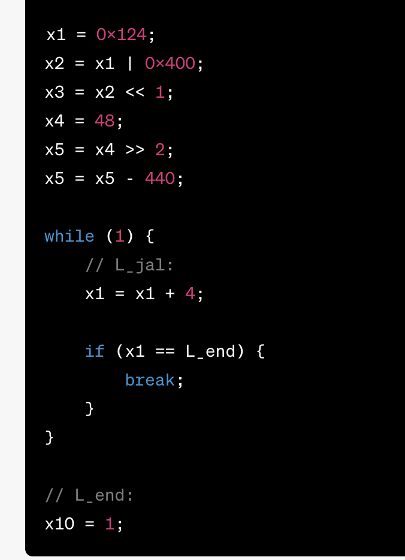

diff.cc 로 제출
### 과제 설명

    //  If the program is given with two arguments
    // 1. First argument:  Input file name for binary instructions
    // ➢ This file includes binary instructions, same as proj1
    // ➢ The contents of this file will be loaded to the instruction memory, from address 0x00000000
    // ◼ First instruction: 0x00000000
    // ◼ Second instruction: 0x00000004
    // ◼ ...
    // 2. Second argument: Number of instructions to execute (N)
    // ◼ If the program is given with three arguments
    // 1. First argument:  Input file name for binary instructions
    // 2. Second argument:  Input file name for binary data
    // ➢ The contents of this file will be loaded to the data memory, from address 0x10000000
    // 3. Third argument: Number of instructions to execute (N)

Number of Instructions to Execute

◼ Your program simulates N instructions.
❖ If there is no more instruction to execute after executing N instructions, stop simulation

#### Data memory

주소 범위: 0x10000000 - 0x1000FFFF
bin 파일은 : 0x10000000 에서 로드됨
data bin file로드 이후에 남은 bytes는 0xFF로 초기화됨

### 인의예지

ssh -p 1398 2022312065@swye.skku.edu
pw22312065

### linux 명령어

dd: 첫번째 줄로 이동
shift, v, g: 전체 선택
d: 전체 삭제

### If you want to submit the ‘project_1’ directory...

    make clean
    rm my_output.txt ref_output.txt
    ~swe3005/bin/submit proj2 ./pa2

<!-- 2022312065 경로에서 실행 -->
<!-- main.cc makefile 파일 있어야 함 그 외의 것들 없어야 함 -->

### Verify the submission

    ~swe3005/bin/check-submission proj2

### Reference Implementation

`~swe3005/2023f/proj2/riscv-sim`

    ~swe3005/2023f/proj2/riscv-sim ~swe3005/2023f/proj2/proj2_1_inst.bin 11

### Test Results

make
./riscv-sim /home/swe3005/2023f/proj2/proj2_1_inst.bin 11 > my_output.txt
/home/swe3005/2023f/proj2/riscv-sim /home/swe3005/2023f/proj2/proj2_1_inst.bin 11 > ref_output.txt
diff my_output.txt ref_output.txt

./riscv-sim /home/swe3005/2023f/proj2/proj2_2_inst.bin 11 > my_output.txt
/home/swe3005/2023f/proj2/riscv-sim /home/swe3005/2023f/proj2/proj2_2_inst.bin 11 > ref_output.txt
diff my_output.txt ref_output.txt

./riscv-sim /home/swe3005/2023f/proj2/proj2_3_inst.bin 100 > my_output.txt
/home/swe3005/2023f/proj2/riscv-sim /home/swe3005/2023f/proj2/proj2_3_inst.bin 100 > ref_output.txt
diff my_output.txt ref_output.txt

./riscv-sim /home/swe3005/2023f/proj2/proj2_4_inst.bin 43 > my_output.txt
/home/swe3005/2023f/proj2/riscv-sim /home/swe3005/2023f/proj2/proj2_4_inst.bin 43 > ref_output.txt
diff my_output.txt ref_output.txt

./riscv-sim /home/swe3005/2023f/proj2/proj2_5_inst.bin /home/swe3005/2023f/proj2/proj2_5_data.bin 11 > my_output.txt
/home/swe3005/2023f/proj2/riscv-sim /home/swe3005/2023f/proj2/proj2_5_inst.bin /home/swe3005/2023f/proj2/proj2_5_data.bin 11 > ref_output.txt
diff my_output.txt ref_output.txt

./riscv-sim /home/swe3005/2023f/proj2/proj2_6_inst.bin 11 > my_output.txt
/home/swe3005/2023f/proj2/riscv-sim /home/swe3005/2023f/proj2/proj2_6_inst.bin 11 > ref_output.txt
diff my_output.txt ref_output.txt

./riscv-sim /home/swe3005/2023f/proj2/proj2_7_inst.bin /home/swe3005/2023f/proj2/proj2_7_data.bin 73 > my_output.txt
/home/swe3005/2023f/proj2/riscv-sim /home/swe3005/2023f/proj2/proj2_7_inst.bin /home/swe3005/2023f/proj2/proj2_7_data.bin 73 > ref_output.txt
diff my_output.txt ref_output.txt

./riscv-sim /home/swe3005/2023f/proj2/proj2_8_inst.bin /home/swe3005/2023f/proj2/proj2_8_data.bin 2001 > my_output.txt
/home/swe3005/2023f/proj2/riscv-sim /home/swe3005/2023f/proj2/proj2_8_inst.bin /home/swe3005/2023f/proj2/proj2_8_data.bin 2001 > ref_output.txt
diff my_output.txt ref_output.txt

./riscv-sim /home/swe3005/2023f/proj2/proj2_9_inst.bin 12 > my_output.txt
/home/swe3005/2023f/proj2/riscv-sim /home/swe3005/2023f/proj2/proj2_9_inst.bin 12 > ref_output.txt
diff my_output.txt ref_output.txt

**10** (입력받음 48)
./riscv-sim /home/swe3005/2023f/proj2/proj2_10_inst.bin 3 > my_output.txt
/home/swe3005/2023f/proj2/riscv-sim /home/swe3005/2023f/proj2/proj2_10_inst.bin 3 > ref_output.txt
diff my_output.txt ref_output.txt

**11**
./riscv-sim /home/swe3005/2023f/proj2/proj2_11_inst.bin /home/swe3005/2023f/proj2/proj2_11_data.bin 1000000000 > my_output.txt
/home/swe3005/2023f/proj2/riscv-sim /home/swe3005/2023f/proj2/proj2_11_inst.bin /home/swe3005/2023f/proj2/proj2_11_data.bin 1000000000 > ref_output.txt
diff my_output.txt ref_output.txt

---

### 컴구개 과제

1. 첫 번째 줄: 내꺼 실행 시켜서 결과값 보기
2. 모범 답안 확인
3. diff 해서 1,2 비교 -> 아무것도 안 나와야지

### 각종 명령어

    make
    make clean
    ./riscv-sim
    chmod +x test.sh
    bash test.sh

### Execution Results

#### 경로

`cd /home/swe3005/2023f/proj2`

    ./riscv-sim

- riscv-sim
- proj1_1.bin
- proj1_2.bin
- ....1_6.bin

- 16진수 -> 2진수 변환/ 나머지 노가다

### 파일 다운

scp -P 1398 2022312065@swye.skku.edu:/home/swe3005/2023f/proj1/riscv-sim /Users/sonah/Downloads
scp -r -P 1398 2022312065@swji.skku.edu:/home/swe3005/2023f/proj2 /Users/sonah/Downloads

**-r: 폴더 산하에 있는 파일들 다운**

### 예시 결과 값
